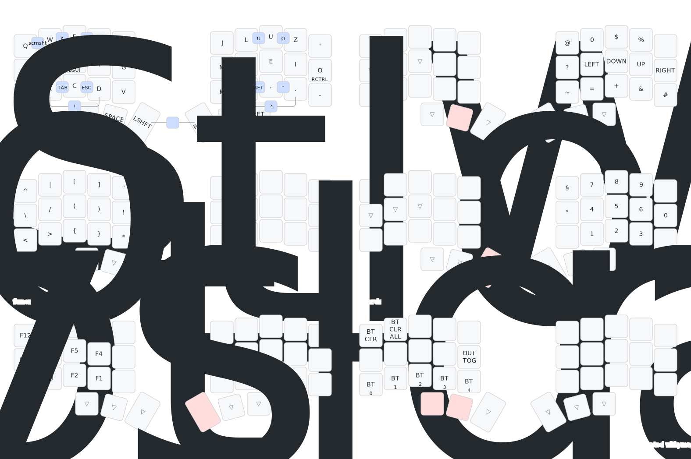

# zmk-config-piantor

> **Note**
> This is a German keymap. The keymap drawing shows the intended keys
> while ZMK sends the default (presumably US ANSI keycodes).
> This will only work, if the input is set to German in the OS.

This is a [ZMK](https://zmk.dev) config repo for my Piantor keyboard.

The repo was initially forked from [Keebart](https://github.com/Keebart/zmk-config).

The in-code visualisation in the keymap file is inspired by [nickfaraco](https://github.com/nickfaraco/zmk-config).

The battery display is from [infely](https://github.com/infely/nice-view-battery).

The home row mod configuration and timings are inspired by [urob](https://github.com/urob/zmk-config)'s config.

## Reference layout

(Visualization generated with [caksoylar/keymap-drawer](https://github.com/caksoylar/keymap-drawer))
